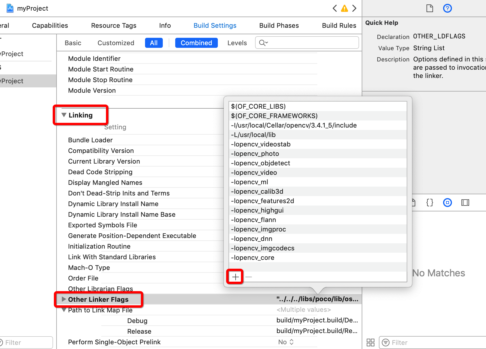
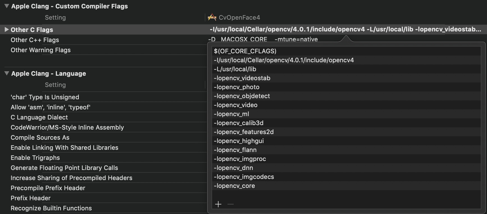

# Fast Many Face Detection with C++/OpenFrameworks on macOS using Neural Networks


## Introduction

[OpenCV](http://opencv.org) and its [OpenFrameworks](http://openframeworks.cc) addon [ofxCv](https://github.com/kylemcdonald/ofxCv) already provide face tracking with haar cascades. However, the speed of detection apparently decreases a lot with the number of faces in the frame, and is generally not good at tilted faces. The newer versions of OpenCV (3.3+) introduced a `dnn` module that facilitates importing of models from many different neural networks, as explored in this [pyimagesearch blog](https://www.pyimagesearch.com/2017/08/21/deep-learning-with-opencv/). This allows us to use a [good caffe face detection model](https://github.com/opencv/opencv/tree/master/samples/dnn/face_detector) that runs lightning fast even when there's a ton of faces in the same frame. However the current version of OpenCV bundled with OpenFrameworks is way out of date. One approach is to try compiling OpenFrameworks with a newer version of OpenCV, as discussed in this [OF forum thread](https://forum.openframeworks.cc/t/how-do-i-use-an-alternative-version-of-opencv-with-of/23280/14). Another approach is directly link against a OpenCV installation on the system, which is what we'll be doing in this document.

This process can be somewhat complex depending familiarity with C++/linking/OF/OpenCv/Xcode stuff. This repo aims to make it much easier by providing detailed steps and ready-to-use code. Hopefully I'll be able to find a even more convenient solution in the future. It is only tested on macOS, but might work in a similar way on Windows/Linux.

## Installing Dependencies

First install OpenCV (3.3+). I tested with 3.4.1 and 4.0.1, but other versions should work too as long as they're >= 3.3.

I recommend using [brew](http://brew.sh):

```bash
brew install opencv
```
I tested with OpenFrameworks 0.9.8 and 0.10.1. Download OpenFrameworks on [their official website](https://openframeworks.cc/download/). No addon is necessary, since we'll be linking against system OpenCV.

You may also need to install either mac [commandline tools](http://osxdaily.com/2014/02/12/install-command-line-tools-mac-os-x/) or [XCode](https://developer.apple.com/xcode/).

And of course, you need to download or clone this repo.

## Fixing OpenCV

There is a conflict between a OpenCV's macro and macOS's macro. This causes an error during  compilation step when using OpenFrameworks. This section introduces a workaround. You can also skip the section, and after you confirm that the error actually occurs when compiling on your system, come back and make the fix.

The error will look something like this:

```
/usr/local/include/opencv2/stitching/detail/blenders.hpp:67:12: error: expected
      identifier
    enum { NO, FEATHER, MULTI_BAND };
           ^
```

To fix the problem, goto `/usr/local/Cellar/opencv/3.4.1_5/include/opencv2/opencv.hpp` (or wherever your OpenCV installation is) and comment out line 89 `#include "opencv2/stiching.hpp"`, since we're not using the functionality anyways.


## C++ & OpenCV only (no OF)

I think it is a good idea to first get OpenCV and DNN's working with plain C++, and incorporate OpenFrameworks later.

First, `cd` to `noof` directory of this repo, then try:

```bash
c++ main.cpp -std=c++11 -lopencv_highgui -lopencv_imgproc -lopencv_dnn -lopencv_core -lopencv_videoio -I/usr/local/Cellar/opencv/3.4.1_5/include
```

You **must** subsitute `-I/usr/local/Cellar/opencv/3.4.1_5/include` with the correct path and version of OpenCV installed on your system. (The above command is the minimal version, if you want to use other functionalities of OpenCV, you can find the full version for copy-pasting on the first line of `noof/main.cpp`).

Hopefully this compiles without errors. Then try:

```bash
./a.out
```

to launch the app. A window should pop up, in it you'll see realtime video feed from your webcam, and a box around each face in the frame.

The main code is located in `noof/main.cpp`, and the neural networks wrapper is located in `noof/caffe_face_det.h`. You'll see a lot of magic numbers in `caffe_face_det.h`, they're taken from this [pyimagesearch blog](https://www.pyimagesearch.com/2018/02/26/face-detection-with-opencv-and-deep-learning/). Messing with the numbers is tested to be a bad idea.

You might notice there're false positives. This is because the threshold is low, and you can add a second argument to `detector.detect(frame)` in `main.cpp` to specify the threshold (0.0-1.0), e.g.

```c++
 vector<a_det> detections = detector.detect(frame, 0.5);
```

If you have a lot of small faces in the frame, like a mass surveillance situation, you might want a lower threshold to detect more faces. If there's only a small number of large faces in the frame, then a higher threshold works better.


## OpenFrameworks + makefile

Now that we know OpenCV is working, we can add the OpenFrameworks support. I think it is a good idea to first get `make` and `make RunRelease` commands working, before we delve into the Xcode blackbox in the next section.

- First, use OpenFrameworks projectGenerator to make a new project. You will **NOT** need any addons. **DO NOT** put ofxOpenCv or ofxCv. Just create a plain, empty project.

- Say you named the project `MyProject`. Now replace the contents of `MyProject/src` folder with the contents of `of/src` folder from this repo. Then also copy the `data/models` folder from this repo to `MyProject/bin/data`.


- Now copy-paste the contents of `of/config.make` from this repo to `MyProject/config.make`. However, you'll need to replace the path and version of OpenCV on line 76. Basically you'll be adding these lines to your `config.make` file:

```
PROJECT_LDFLAGS += -lopencv_videostab -lopencv_photo -lopencv_objdetect -lopencv_video -lopencv_ml -lopencv_calib3d -lopencv_features2d -lopencv_highgui -lopencv_flann -lopencv_imgproc -lopencv_dnn -lopencv_imgcodecs -lopencv_core
PROJECT_LDFLAGS += -I/usr/local/Cellar/opencv/3.4.1_5/include
```

- If you are using OpenCV 4.0.1, the link path is a little different: 

```
PROJECT_LDFLAGS += -lopencv_videostab -lopencv_photo -lopencv_objdetect -lopencv_video -lopencv_ml -lopencv_calib3d -lopencv_features2d -lopencv_highgui -lopencv_flann -lopencv_imgproc -lopencv_dnn -lopencv_imgcodecs -lopencv_core
PROJECT_LDFLAGS += -I/usr/local/Cellar/opencv/4.0.1/include/opencv4
```


- You might also need to add `PROJECT_CFLAGS += ` with the exact same flags as `PROJECT_LDFLAGS` in `config.make` file.

```
PROJECT_CFLAGS += -lopencv_videostab -lopencv_photo -lopencv_objdetect -lopencv_video -lopencv_ml -lopencv_calib3d -lopencv_features2d -lopencv_highgui -lopencv_flann -lopencv_imgproc -lopencv_dnn -lopencv_imgcodecs -lopencv_core
PROJECT_CFLAGS += -I/usr/local/Cellar/opencv/4.0.1/include/opencv4
```


- Now, `cd` into `MyProject` folder, and try:

```bash
make
```

- If you see an error complaining about `enum` and `NO` etc., see **Fixing OpenCV** section above for a workaround. Then run `make` again. 

- If there's no errors, run

```bash
make RunRelease
```

A window should pop up, in it you'll see realtime video feed from your webcam, and a box around each face in the frame. Again, you might want to adjust the detection threshold, using the same method described at the end of previous section.


## OpenFrameworks + Xcode

Great! The most difficult parts are now done. You can run your OpenFrameworks face detection projects from the commandline. However, if you for some reason enjoy working with the GUI of Xcode, you can do so by making the following changes:

- Click the project name on left sidebar, then go to `Build Settings`, and find the `Search Paths` section. The section is hard to find but it's there.


- Add two more entries to `Header Search Paths`: `/usr/local/include` and `/usr/local/Cellar/opencv/3.4.1_5/include`. Again, change OpenCV path to the correct version and location of your installation.
(Add them by clicking on the text on the right, a box will pop up, click the + sign).


- If you are using Xcode 10 with OpenCV 4.0.1 and openFrameworks 0.10.1, you should change your `Header Search Paths` into this:


- Find `Linking > Other Link Flags`, and add a bunch of new flags. Don't worry: you don't need to add one by one, just enter all of them at once separated by spaces, and Xcode will format automatically. e.g. you can copy-paste the below:

```
-I/usr/local/Cellar/opencv/3.4.1_5/include -L/usr/local/lib -lopencv_videostab -lopencv_photo -lopencv_objdetect -lopencv_video -lopencv_ml -lopencv_calib3d -lopencv_features2d -lopencv_highgui -lopencv_flann -lopencv_imgproc -lopencv_dnn -lopencv_imgcodecs -lopencv_core
```



- The path is different using OpenCV 4.0.1:

```
-I/usr/local/Cellar/opencv/4.0.1/include/opencv4 -L/usr/local/lib -lopencv_videostab -lopencv_photo -lopencv_objdetect -lopencv_video -lopencv_ml -lopencv_calib3d -lopencv_features2d -lopencv_highgui -lopencv_flann -lopencv_imgproc -lopencv_dnn -lopencv_imgcodecs -lopencv_core
```


- You might also need to add the exact same flags to `Apple Clang - Custom Compiler Flags > Other C Flags`




- Finally click the play button, everything should work now!


## Face Embedding and Tracking

So far, we can obtain all the bounding boxes of the faces in the frame. However, we can also do some embedding (for face recognition) and some tracking. I already have working code for that, and will hopefully publish documentation for those soon.


